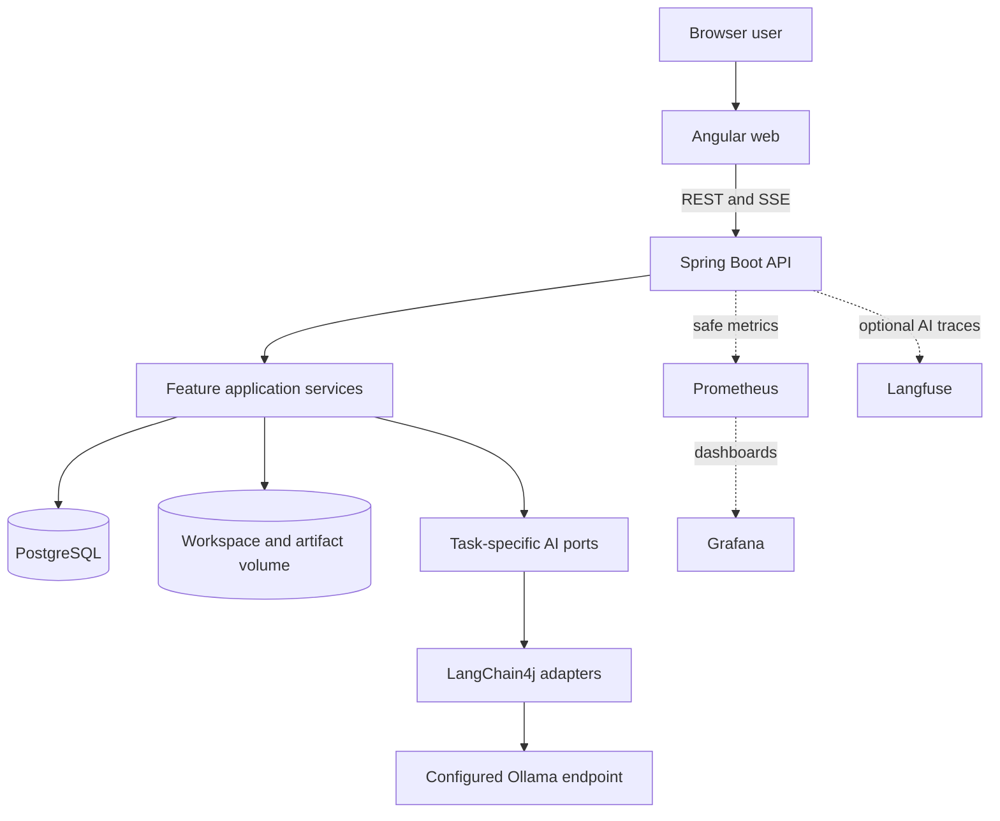

# Nook Forge AI

> **Turn local files into useful work.**


[](LICENSE)


Nook Forge AI is a local-first workspace for analyzing files and ZIP archives, comparing documents, extracting tasks, and generating structured plans, reports, and project documentation with Angular, Spring Boot, LangChain4j, Ollama, and Docker.

## Archive status

**This ZIP is a planning and governance baseline, not a runnable application.** It contains the approved architecture direction, release maps, 36 ordered stories, Codex roles, repository skills, configuration rules, ADRs, security rules, visual-documentation rules, and verification scripts. Application code starts with `NFA-001` and must be implemented one story at a time.

No current document claims that Spring Boot, Angular, Docker Compose, Ollama, Langfuse, Prometheus, or Grafana already run in this archive.

The repository is maintained as a personal portfolio project. No external development workflow is defined at this stage.

## Planned product path

```text
Files, notes, or a project ZIP
              ↓
     safe local workspace
              ↓
       choose an AI task
              ↓
  bounded LangChain4j workflow
              ↓
 structured result and evidence
              ↓
 Markdown or ZIP artifact export
```

The first planned task types are:

- review a document;
- extract tasks and open questions;
- create a step-by-step plan;
- compare documents;
- summarize a multi-file workspace;
- find cross-file inconsistencies;
- generate project documentation.

See [concrete home use cases](docs/use-cases.md) and the [product vision](docs/product-vision.md).

## Planned architecture



The backend is one modular Spring Boot monolith. The frontend is one Angular application. Maven and npm keep their normal jobs inside a small polyglot monorepo; no Nx or Turborepo layer is planned.

See the [architecture](docs/architecture.md), [monorepo decision](docs/monorepo.md), and [AI provider boundary](docs/ai-provider-boundary.md).

## Planned Ollama modes

`NFA-005` will support both modes below. These commands become supported only after that story is implemented and tested.

### Option A: use an existing Ollama endpoint

The endpoint may be a native Ollama service, another container, or another reachable machine.

```bash
cp .env.example .env
docker compose up --build
```

The planned default is:

```env
OLLAMA_BASE_URL=http://host.docker.internal:11434
```

### Option B: run a Nook Forge-owned Ollama container

```bash
cp .env.example .env
docker compose \
  -f docker-compose.yml \
  -f docker-compose.ollama.yml \
  up --build
```

The dedicated service will keep models in its own named volume and expose `11435` on the host by default. Ollama will not be installed inside the API or web image.

See [configuration and Ollama modes](docs/configuration.md).

## Environment rule

```text
.env.example   committed examples and safe local defaults
.env           local runtime values and secrets, never committed
```

The repository audit rejects a checked `.env` file and verifies the ignore rule. OpenRouter keys, cloud keys, and Langfuse secrets must never be committed.

## Release plan

| Release | Outcome | Stories |
| --- | --- | --- |
| [0.1 Foundation](docs/releases/release-0.1-foundation/README.md) | Monorepo, Spring Boot, Angular, PostgreSQL, Docker, both Ollama modes, and one structured AI path | `NFA-001`–`NFA-007` |
| [0.2 Task workflows](docs/releases/release-0.2-task-workflows/README.md) | Persistent tasks, safe file intake, async progress, first task types, Angular workspace, and Markdown artifacts | `NFA-008`–`NFA-015` |
| [0.3 Multi-file workspaces](docs/releases/release-0.3-multi-file-workspaces/README.md) | Multiple files, secure ZIP extraction, bounded context, cross-file checks, and ZIP result export | `NFA-016`–`NFA-023` |
| [0.4 Documentation Forge](docs/releases/release-0.4-documentation-forge/README.md) | Evidence-aware README, architecture, configuration, development, and user-guide generation | `NFA-024`–`NFA-029` |
| [0.5 Observability and reliability](docs/releases/release-0.5-observability-and-reliability/README.md) | Safe logs, optional Langfuse, Prometheus, Grafana, recovery, and operator proof | `NFA-030`–`NFA-036` |

The [roadmap](docs/roadmap.md) keeps LangGraph4j, application MCP, OpenRouter, other providers, Elasticsearch, and Kibana as possible later options. They have no committed release or stories. The [future option notes](docs/future/README.md) define safe entry conditions, including a minimal read-only MCP hello-world slice.

## Codex delivery gates

Every story uses separate approvals:

```text
next valid story
      ↓
architect plan
      ↓
USER APPROVES PLAN
      ↓
Codex asks to implement
      ↓
USER APPROVES IMPLEMENTATION
      ↓
implementation, tests, docs, review
      ↓
proposed commit message
      ↓
USER APPROVES COMMIT
      ↓
commit hash
      ↓
separate approval for push or next story
```

Read [`AGENTS.md`](AGENTS.md), the [story workflow](docs/story-workflow.md), and the [Codex setup](.codex/README.md) before implementation.

## Penpot and visual evidence

When the user supplies a Penpot design link for an active UI story and Penpot MCP is available, Codex must inspect the focused design before it writes the implementation plan. Design writes happen only after the separate plan and implementation approvals, and every change is verified against Penpot, repository design tokens, Angular output, and checked screenshots.

Implemented releases add privacy-safe Playwright screenshots to the README, user guide, and release evidence where they explain real behavior. Mermaid flowcharts use a top-to-bottom layout by default so they remain readable in narrow documentation views.

No Penpot project, file, page, board, or object ID is invented in this planning archive. No product screenshot is fabricated before the application exists.

See the [design handoff](docs/design/README.md), [visual-documentation policy](docs/visual-documentation.md), [UI brief](docs/design/ui-brief.md), and [token contract](docs/design/token-contract.md).

## Documentation

[Documentation index](docs/README.md) · [User guide](docs/user-guide.md) · [Architecture](docs/architecture.md) · [Domain model](docs/domain-model.md) · [File workspaces](docs/file-workspaces.md) · [Security](docs/security.md) · [Development](docs/development.md) · [Testing](docs/testing.md) · [Technology stack](docs/technology-stack.md) · [ADRs](docs/decisions/README.md) · [Planning scope](docs/planning-scope.md)

## Verify this planning archive

```bash
python3 .agents/skills/release-evidence/scripts/verify_repository.py
python3 -m unittest discover \
  -s .agents/skills/release-evidence/scripts \
  -p 'test_*.py'
```

The audit checks story continuity and format, release links, JSON and TOML files, brand identity, `.env` safety, local Markdown links, visual-documentation rules, Mermaid direction, SPDX rules, and short source comments.

## Brand and technical identifiers

| Purpose | Value |
| --- | --- |
| Product name | `Nook Forge` |
| Full product name | `Nook Forge AI` |
| Repository | `nook-forge-ai` |
| Application ID | `nook-forge-ai` |
| Java base package | `io.nookforge` |
| Maven artifact | `nook-forge-api` |
| npm scope | `@nookforge/*` |
| Docker Compose project | `nookforge` |
| Database | `nookforge` |
| User story prefix | `NFA` |

Canonical values live in [`packages/brand/brand.json`](packages/brand/brand.json).

## License

Apache License 2.0. See [`LICENSE`](LICENSE).

## Contact

**Project maintainer: Keresztes Zsolt**

| Platform | Link |
| --- | --- |
| Website | [kereszteszsolt.hu](https://kereszteszsolt.hu/) |
| GitHub | [@kereszteszsolt](https://github.com/kereszteszsolt) |

> The maintainer's website is available in Hungarian, English, Romanian, and German.

## ☕ Ways to support

[Explore ways to support the maintainer and their projects.](https://kereszteszsolt.hu/ways-to-support)

<p align="center">
  <a href="https://buymeacoffee.com/kereszteszsolt"></a><br>
  <strong>Every coffee counts! ☕❤️</strong>
</p>

---

<p align="center">
  <strong>Made with ❤️ by <a href="https://kereszteszsolt.hu/">Keresztes Zsolt</a></strong><br>
  ⭐ Star this repository when the project becomes useful to you.
</p>
