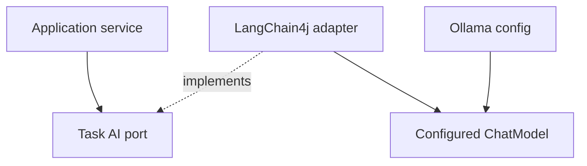

# AI and provider boundary

## Current plan

LangChain4j is the Java AI integration layer. Ollama is the only supported model provider through Release 0.5.

The application must not depend on `OllamaChatModel`, LangChain4j annotations, provider request classes, or raw model JSON. Those details stay in an outbound adapter and Spring configuration.

## Task-specific ports

Prefer small use-case contracts over one generic “AI client”:

```text
PlanGenerator.createPlan(input) -> PlanResult
DocumentReviewer.review(input) -> ReviewResult
TaskExtractor.extract(input) -> TaskListResult
DocumentComparator.compare(input) -> ComparisonResult
WorkspaceAnalyst.summarize(input) -> WorkspaceSummary
DocumentationGenerator.generate(input) -> DocumentationDraft
```

Application services decide when a port is called and how results are stored. AI adapters decide prompt shape, model call details, output parsing, and bounded repair.

## LangChain4j adapter

The adapter may use AI Services, prompt templates, JSON schema support, or structured output mapping. It must return domain or application records that have no LangChain4j type.



## Structured output

Each task owns a versioned result schema. The adapter validates required fields, limits list lengths, normalizes unsafe text, and rejects output that cannot be repaired within a small bound.

A failed schema parse must produce a clear task failure. It must not save a partly parsed result as complete.

## Prompt rules

- System instructions define the task and result schema.
- User goals and uploaded content are delimited as untrusted data.
- File text cannot change system rules or request tools.
- The prompt tells the model to use only the supplied source scope.
- The result must list missing or conflicting facts instead of inventing them.
- Prompt template versions are stored with the task.

## Context bounds

A task receives a clear maximum context budget. Large workspaces use deterministic file selection, per-file extraction, optional summaries, and visible omission records.

The app must not concatenate every file into one unbounded prompt. When the selected model cannot fit the required scope, the task fails or narrows scope with a user-visible reason.

## Model configuration

Current configuration contract:

```env
AI_PROVIDER=ollama
OLLAMA_BASE_URL=http://host.docker.internal:11434
OLLAMA_MODEL=llama3.1:8b
OLLAMA_REQUEST_TIMEOUT=120s
```

`AI_PROVIDER` accepts only `ollama` until a later approved provider story exists. An invalid value stops startup with a clear configuration error.

`NFA-006` still owns the LangChain4j client, configured chat model, and first model request.

## Real-model proof

Unit tests use fake task ports or a stub model. A release claim for AI behavior also needs a smoke test against a real installed Ollama model in both supported deployment modes.

Smoke fixtures use invented content. They must not send personal documents to tracing systems.

## Future OpenRouter or other provider

A later provider is allowed only when all items below are approved:

- explicit provider and model selection;
- no silent fallback from Ollama;
- secret-only environment configuration;
- clear UI notice that content may leave the machine;
- provider-specific timeout and error mapping;
- privacy tests and documentation;
- unchanged application and domain ports.

OpenRouter is a candidate, not part of Releases 0.1 through 0.5.

## Future LangGraph4j

LangGraph4j is useful only when tasks need real branching, checkpoints, resumable state, or a human approval node. A linear list of task steps is not enough reason to add it.

## Future application MCP

Application MCP may later expose approved tools or connect to safe local services. It requires a capability allowlist, read-only defaults, clear write approval, audit records, and path isolation.

Penpot MCP is not this feature. Penpot MCP is a development and design tool used by Codex when connected.
