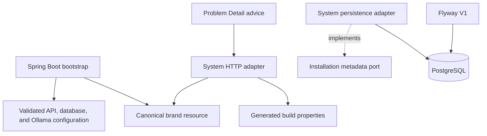
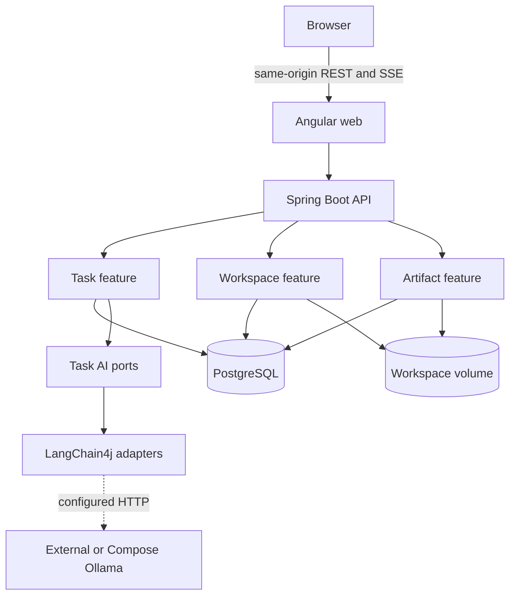
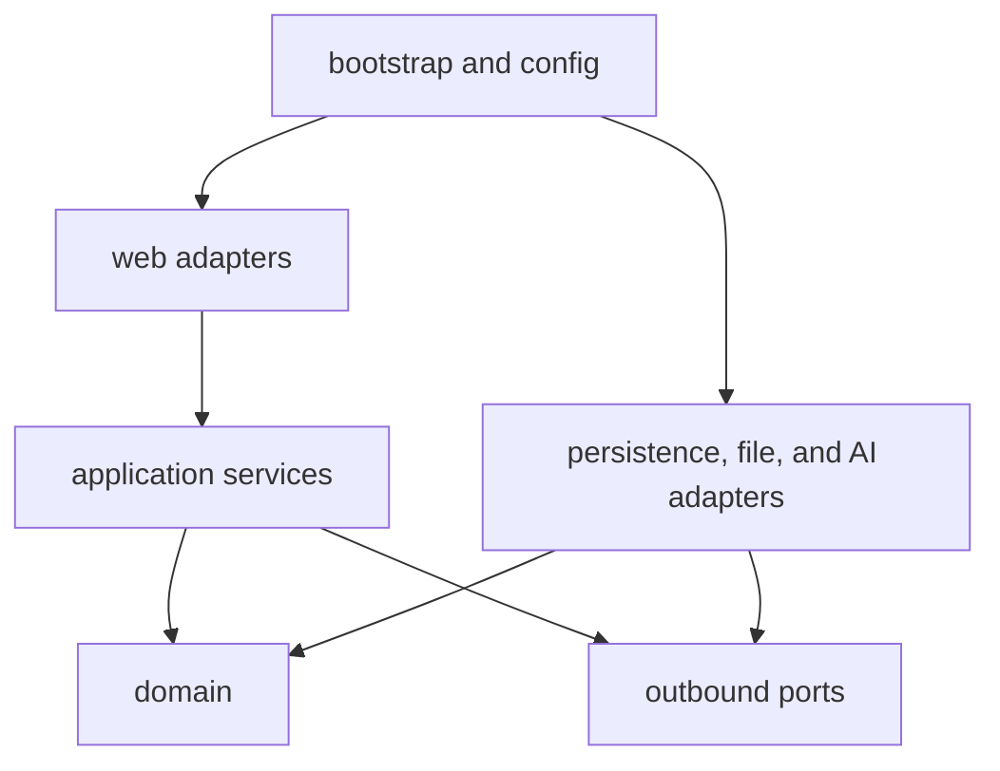
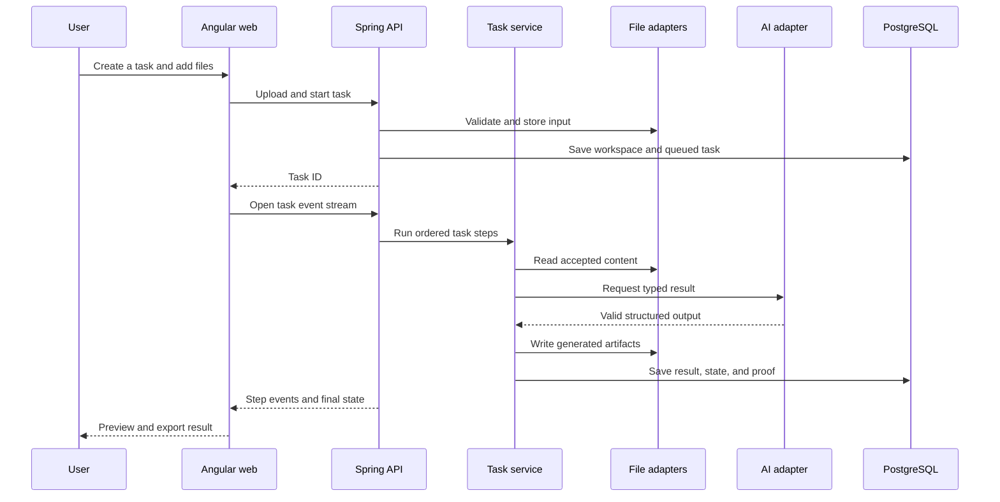
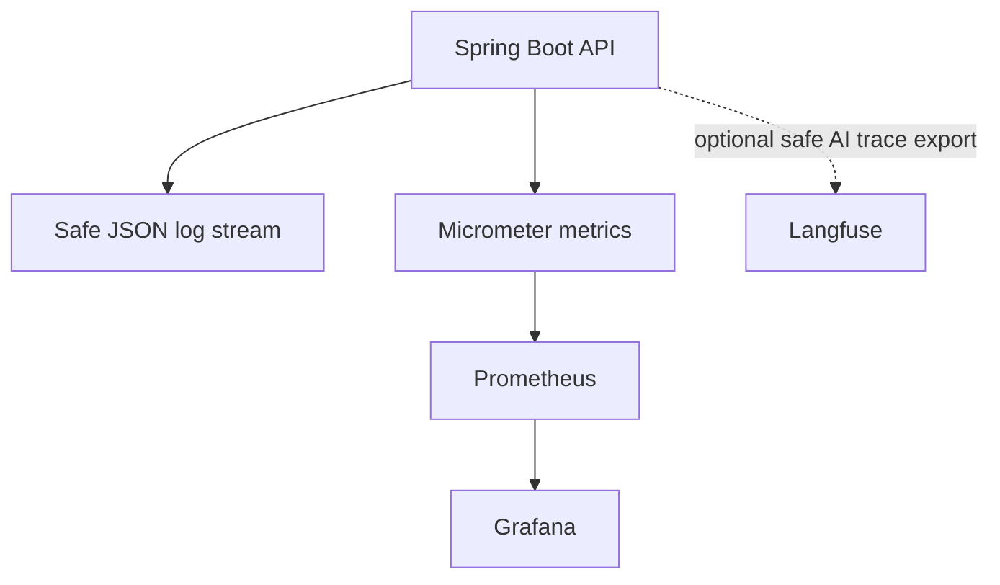

# Architecture

## Current backend foundation

`NFA-002` adds the verified Spring Boot shell, `NFA-004` adds the PostgreSQL foundation, and `NFA-005` adds the two container deployment modes and validated Ollama settings. The live system feature now has one small domain value, one outbound port, and a JPA persistence adapter for installation metadata; task, workspace, file, artifact, and AI adapter packages remain absent.



The system controller maps immutable response records directly because this foundation has no use-case orchestration. Persistence entities and Spring Data repositories remain package-private inside the outbound adapter. Later feature controllers must follow the full dependency direction below.

## Target state through Release 0.5

Nook Forge is one local web application with a modular Spring Boot backend, Angular frontend, PostgreSQL state, local file volumes, and a configured Ollama endpoint. Optional observability stays outside the core request path.



## Deployment shape

The base Compose stack starts:

```text
web
api
postgres
```

It receives an existing Ollama endpoint through `OLLAMA_BASE_URL`. The optional Ollama override adds:

```text
ollama
ollama model volume
```

The managed API waits for Ollama health and uses `http://ollama:11434`; the base API does not make an external endpoint part of Compose health. Both modes use the same application source and keep host ports on loopback by default.

Release 0.5 adds an independent optional observability override. Core services must not depend on the monitoring services to start or finish a task.

## Backend package shape

```text
apps/api/src/main/java/io/nookforge/
├── bootstrap/                   # app entry and shared composition
├── shared/
│   ├── config/
│   ├── error/
│   ├── time/
│   └── observability/
├── task/
│   ├── domain/
│   ├── application/
│   │   ├── port/in/
│   │   ├── port/out/
│   │   └── service/
│   └── adapter/
│       ├── in/web/
│       └── out/{ai,persistence}/
├── workspace/
│   ├── domain/
│   ├── application/
│   └── adapter/
├── sourcefile/
│   ├── domain/
│   ├── application/
│   └── adapter/
├── artifact/
│   ├── domain/
│   ├── application/
│   └── adapter/
└── documentation/
    ├── domain/
    ├── application/
    └── adapter/
```

A feature may use fewer folders when the code is small. Empty forwarding layers are not allowed.

## Package roles

| Area | Owns | Must not own |
| --- | --- | --- |
| Web adapter | HTTP validation, OpenAPI, Problem Details, SSE mapping | business order, file paths, provider setup |
| Application | use-case order, transaction boundaries, task steps, safe errors | concrete JPA, Ollama, LangChain4j, ZIP APIs |
| Domain | task and workspace rules, value objects, states | Spring, HTTP, database, file system, model SDKs |
| Persistence adapter | JPA entities, repositories, mappings, Flyway-aligned queries | HTTP contracts or prompt policy |
| File adapter | storage, checksum, type checks, extraction, cleanup, export | task choice or UI status text |
| AI adapter | LangChain4j AI Services, prompts, structured mapping, model calls | database entities or controller work |
| Bootstrap/config | concrete beans and provider selection | product use-case rules |

## Dependency direction



ArchUnit tests must reject:

- domain imports from Spring, JPA, LangChain4j, Ollama, ZIP, or HTTP packages;
- application imports from concrete adapters;
- web adapters that access JPA repositories or file paths directly;
- persistence entities exposed as API records;
- concrete model creation outside configuration.

## Angular shape

```text
apps/web/src/app/
├── core/
│   ├── api/
│   ├── config/
│   ├── error/
│   └── layout/
├── shared/
│   ├── ui/
│   ├── models/
│   └── markdown/
└── features/
    ├── dashboard/
    ├── tasks/
    ├── workspaces/
    ├── files/
    ├── artifacts/
    └── documentation/
```

Components do not call `fetch` or build URLs. The typed API boundary owns REST and SSE connections. Feature services or stores own feature state; a global state library is not planned.

## Main runtime flow



## Async execution

Release 0.2 plans an in-process task executor with persisted task and step state. It does not add Kafka, RabbitMQ, or another queue service. Release 0.5 adds startup recovery and stale-task rules before the system claims operational reliability.

## Data ownership

PostgreSQL stores durable metadata, status, relations, provider/model identity, prompt template version, and artifact records. A local volume stores original uploads, isolated extracted content, and generated artifact files.

Database rows store server-generated relative storage keys, not user-controlled absolute paths. The storage adapter owns all path resolution.

## AI boundary

Application services call task-specific ports such as `DocumentReviewer`, `TaskExtractor`, `PlanGenerator`, and `DocumentComparator`. LangChain4j adapters implement those ports and return validated domain records.

Ollama model creation belongs in infrastructure configuration. A later provider changes configuration and adapter wiring, not domain or task code.

## Result truth model

Generated documentation and analysis results keep three classes of statement:

- `OBSERVED`: read directly from a source file or runtime contract;
- `INFERRED`: model interpretation based on listed sources;
- `UNKNOWN`: missing or conflicting data that needs a person.

The UI and exported reports must keep this distinction visible.

## No automatic source edits

Nook Forge writes only to generated artifact locations. A later export may build an augmented copy of an uploaded archive, but it must never change the original file or workspace in place.

## Optional observability



The exact Java-to-Langfuse transport is selected during `NFA-032` from the current supported integration path and remains behind an adapter. No collector or separate tracing platform is planned. Content capture is off by default, and Kibana is not part of the planned stack.
