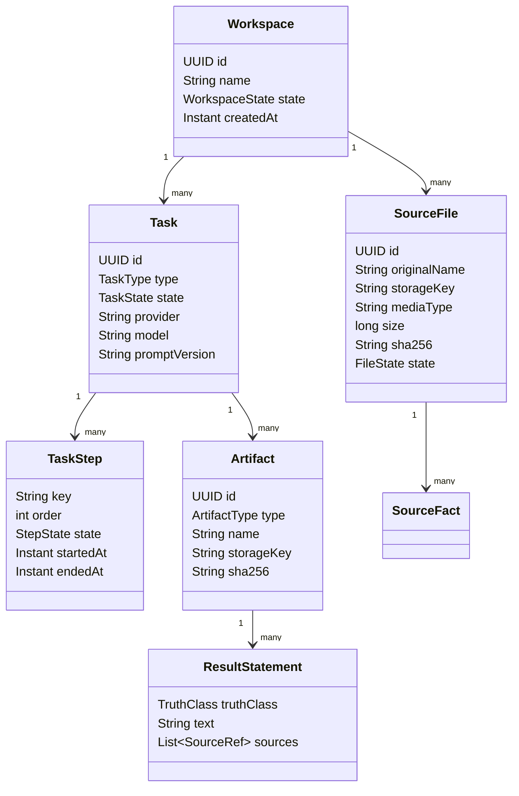

# Domain model

This model is a target for Releases 0.2 through 0.4. Exact table and class names are fixed only by their owning stories.

## Main concepts



## Workspace

A workspace is the safe boundary for one user job or related set of jobs. It owns accepted input metadata, task history, and generated artifacts. It does not expose a raw operating-system path.

Planned states:

```text
CREATED → PREPARING → READY
                    ↘ REJECTED
```

## Source file

A source file keeps the original name for display and a generated storage key for access. It also records size, checksum, detected media type, source kind, and intake result.

Planned states:

```text
RECEIVED → VALIDATED → READY
        ↘ IGNORED
        ↘ REJECTED
        ↘ FAILED
```

A workspace manifest records why a file was accepted, ignored, or rejected.

## Task

A task is one structured unit of work. Its type controls the allowed input, ordered steps, AI port, output schema, and artifact templates.

Planned states:

```text
QUEUED → PREPARING → ANALYZING → GENERATING → COMPLETED
   ↘ FAILED       ↘ FAILED      ↘ FAILED
```

`CANCELLED` is not required until a story defines safe cancellation behavior.

## Task step

Task steps support SSE progress, audit proof, and clear failure points. Step keys are stable machine values; labels are user-facing text supplied by the API contract.

A later retry creates a new execution attempt or resets only a story-approved safe step. It must not hide the old failure.

## Artifact

An artifact is a generated file or structured result owned by a task. Common planned types are Markdown report, JSON manifest, documentation file, and ZIP bundle.

Artifacts store a checksum and media type. The user may preview or download them, but they never replace an original upload.

## Model identity

Each task records the provider, model, and prompt template version used for its result. Releases 0.1 through 0.5 allow only `ollama` as the provider value.

## Result statements and source proof

A result statement can cite one or more source references. A source reference may use file ID, page number, line range, section, JSON path, or code symbol when the extractor can provide it.

This is not full RAG. It is provenance for the bounded files used by the task.
