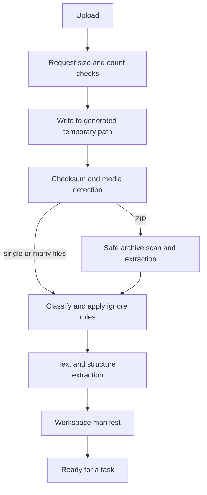

# File and archive workspaces

## Goal

A user may add one file, several files, or one ZIP archive. Nook Forge validates the input, builds an isolated workspace, extracts supported content, records every decision, and gives AI tasks a bounded source set.

## Intake pipeline



## Planned input forms

- one supported file;
- several supported files in one workspace;
- one ZIP archive with a preserved safe relative tree.

Multiple uploaded archives and nested archive extraction are not required through Release 0.5.

## Planned supported content

The initial set should include:

- plain text and Markdown;
- JSON, YAML, XML, properties, and common text configuration;
- Java, TypeScript, JavaScript, HTML, CSS, SCSS, SQL, shell, and Docker text files;
- PDF and DOCX text extraction;
- common build files such as `pom.xml`, Gradle files, `package.json`, and Compose YAML.

Exact types are locked in `NFA-019` after parser tests. Files with no safe text extraction stay ignored or rejected with a reason.

## Default ignored data

```text
.git/
node_modules/
target/
build/
dist/
coverage/
.gradle/
.idea/
.vscode/
__pycache__/
*.class
*.jar
*.exe
*.dll
*.so
images, audio, video, archives inside archives
```

A user cannot disable safety exclusions in the first releases.

## ZIP safety

Before extraction, the archive adapter must enforce:

- maximum upload bytes;
- maximum entry count;
- maximum total expanded bytes;
- maximum bytes per entry;
- maximum path depth;
- normalized relative paths under one generated root;
- no absolute paths or `..` traversal;
- no symbolic links, hard links, devices, or special file types;
- no encrypted archive;
- no nested archive extraction;
- cleanup on success, failure, timeout, and cancellation.

The implementation must count actual streamed output. It must not trust ZIP metadata alone.

## Storage rules

Original files are stored by a generated key and made read-only to the application workflow after intake. User file names are display metadata only.

A safe logical layout may look like:

```text
workspaces/{workspace-id}/
├── source/
│   └── {file-id}
├── extracted/
│   └── safe-relative-tree/
├── generated/
│   └── {task-id}/
└── temp/
```

Only the storage adapter resolves these paths.

## Workspace manifest

The manifest records:

- original name and safe relative name;
- size, checksum, and detected media type;
- accepted, ignored, rejected, or failed state;
- extractor and extractor version when used;
- page, line, section, or symbol metadata when available;
- reason for every omission;
- totals used against configured limits.

The user can inspect the manifest before trusting a result.

## Context assembly

Small inputs may be sent as direct bounded content. Large workspaces use a deterministic pipeline:

1. rank files by task type and structural importance;
2. extract compact facts or per-file summaries;
3. reserve space for system rules and output schema;
4. include only the accepted budget;
5. record which files or sections were omitted.

No task may silently pretend it read every file.

## Export

The first archive export is generated-only:

```text
nookforge-result.zip
├── reports/
├── generated-docs/
└── manifest.json
```

Release 0.4 may add an augmented-copy export:

```text
original files copied to a new archive
+
approved generated documentation
```

The original upload is never changed or overwritten.
