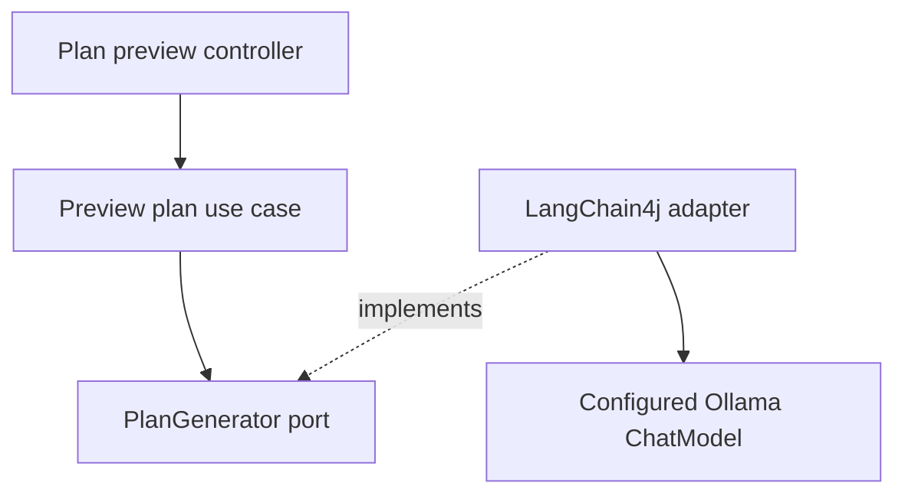

# Release 0.1 implementation plan

## Target

Create the first real vertical slice without hiding the native Java and Angular toolchains. The release ends with a user entering a short goal in Angular and receiving a typed plan from LangChain4j and a configured Ollama model.

## Planned repository tree

```text
apps/api                 Spring Boot app and Maven Wrapper
apps/web                 Angular app and npm lock
packages/brand           stable identity
packages/design-tokens   approved token source and generator
infra/postgres           database support files
docs                     current guides and release proof
docker-compose.yml       web, api, postgres, external Ollama endpoint
docker-compose.ollama.yml optional managed Ollama
```

## Backend path



The preview endpoint is small and temporary. `NFA-008` removes it when the durable task API owns plan creation. The `PlanGenerator` port and typed result may remain when their ownership still fits.

## Configuration

Spring configuration groups AI, database, and local service settings. Compose passes values from `.env` and never mounts `.env` into a public image layer.

The base Compose file supports an existing Ollama endpoint. The override adds one dedicated service and model volume. Both modes use the same API image and product code.

## Frontend path

Angular starts with a responsive tool shell and one plan form. The API boundary owns the request. Components show loading, success, model unavailable, invalid result, and retry states.

Design tokens are approved before they are used. A user-supplied Penpot link is inspected before planning when MCP is available, while design writes wait for separate approvals. The app build reads only repository files.

## Data

PostgreSQL and Flyway are established without inventing the full task schema early. The first migration stores only approved foundation metadata needed to prove durable database setup.

## Verification

The release needs Java, Angular, token, repository, Compose, Testcontainers, real-model, Penpot handoff, Playwright screenshot, and documentation checks. The same smoke fixture runs against an existing Ollama endpoint and the Compose-managed Ollama service.

## Rollback

Each story leaves the repository runnable for its current scope. A failed cross-cutting story stays uncommitted unless the user approves a smaller recovery commit.
