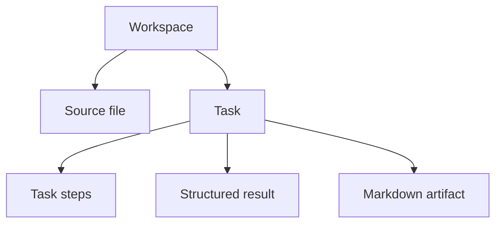
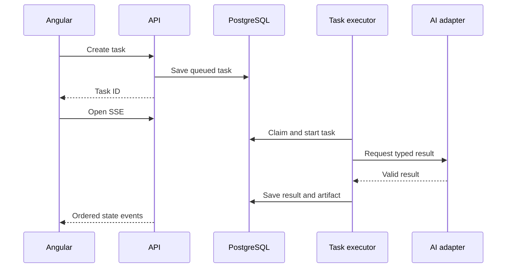

# Release 0.2 implementation plan

## Target

Replace the transient Release 0.1 preview with a durable task workspace. A user can add a goal or supported file, start a task, watch saved steps, return after reload, inspect a typed result, and export Markdown.

## Main model

The first task types are `REVIEW_DOCUMENT`, `EXTRACT_TASKS`, `CREATE_PLAN`, and `COMPARE_DOCUMENTS`. Each type owns a request schema, ordered steps, AI port, result schema, and Markdown template.

## Execution

One bounded in-process executor is enough for this release. The database is the state source, but crash recovery remains a Release 0.5 claim.

## File boundary

Release 0.2 accepts plain text and Markdown only. Files use generated storage keys, checksums, media checks, safe names, and immutable source bytes. Two files are allowed only for comparison.

## API and web

OpenAPI defines workspaces, uploads, tasks, results, artifacts, and errors. Angular uses one typed boundary and SSE reconnect logic. No component parses wire JSON directly.

## AI rules

All task outputs are typed and bounded. Prompts delimit file content as data. Invalid output may use one small repair pass, then the task fails.

## Verification

The release needs persistence restart proof, async state tests, SSE reconnect tests, safe file tests, four task smoke fixtures, Markdown checksum proof, and both Ollama deployment modes.
