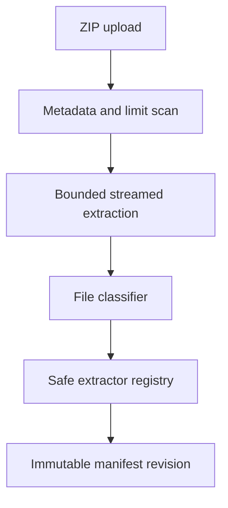

# Release 0.3 implementation plan

## Target

Add several-file and ZIP input without making the model context or local file system unsafe. A user can inspect every intake choice, run cross-file work, and export a generated result bundle.

## Archive boundary

Actual streamed bytes enforce expansion limits. The extractor rejects traversal, absolute paths, links, devices, encryption, duplicate normalized paths, and nested archive extraction.

## File classification

Deterministic rules select accepted, ignored, rejected, or failed state before model work. Common source, config, build, Markdown, PDF, and DOCX files may be supported after parser fixtures pass.

No parser runs an uploaded build, script, macro, package install, test, or code path.

## Bounded context

Each task type has a source budget. Structural files and task-relevant kinds rank first. Large files are shortened or summarized with proof, and every omission is visible.

This release uses no embeddings, vector store, RAG, or hidden semantic search.

## Cross-file tasks

`SUMMARIZE_WORKSPACE` describes the file set and key work. `FIND_INCONSISTENCIES` reports conflicting facts with source sides. Both use the same truth labels and provider rules as earlier tasks.

## Export

The result ZIP contains generated reports and manifests only. It uses safe deterministic paths, checksums, size limits, and partial-write cleanup. Source files stay outside this export.

## Verification

Security fixtures cover ZIP Slip, bombs, links, duplicates, encryption, nested archives, parser faults, cleanup, and limits. Runtime proof covers a realistic invented project ZIP in both Ollama modes.
