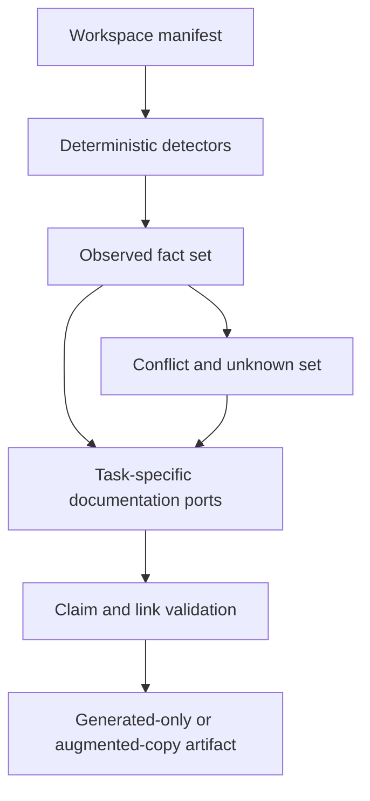

# Release 0.4 implementation plan

## Target

Turn an uploaded software project into proposed, evidence-aware documentation. Nook Forge reads files as data and never runs the uploaded project.

## Fact pipeline



Observed facts keep source locations. Model statements that go beyond a direct fact use `INFERRED`. Missing or conflicting data uses `UNKNOWN`.

## Generated files

The planned output can include:

```text
README.md
docs/overview.md
docs/architecture.md
docs/configuration.md
docs/development.md
docs/testing.md
docs/user-guide.md
manifest/facts.json
manifest/sources.json
manifest/validation.json
```

Templates define required sections. AI fills bounded content from the fact set and source scope. Mermaid flowcharts use top-to-bottom layout by default and wide systems split into smaller diagrams.

## Safe claims

Commands, ports, versions, provider names, features, and deployment paths are current claims only when evidence supports them. Recommendations are labeled and do not become implementation facts.

Secret-like files are excluded from AI context and output. Config docs may name a variable but never copy a detected secret value. Verified source screenshots may be copied with proof, but missing visual evidence becomes a clear gap instead of a fabricated image.

## Export modes

Generated-only exports contain new documentation and manifests. An augmented-copy export creates a new archive with approved safe source files plus generated docs. It never edits the source archive or a live Git tree.

## UI

The documentation workspace shows generated files, source facts, conflicts, claim labels, Mermaid source, verified images, validation, and diff views. Export stays blocked while validation has a blocking error.

## Verification

Fixture projects cover Java, Angular, mixed stacks, sparse docs, stale docs, conflicting versions, secret files, broken links, missing screenshots, invalid Mermaid, and hostile instructions. Proof includes source immutability and final bundle checksums.
