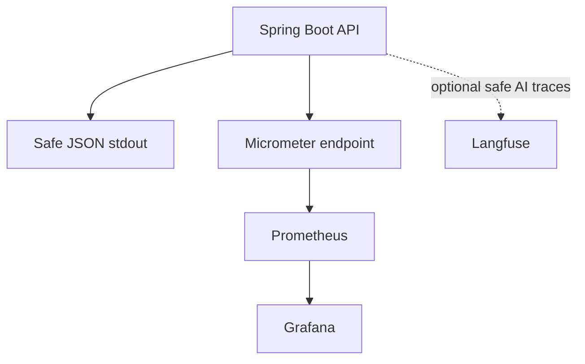

# Release 0.5 implementation plan

## Target

Make local operation easier to inspect and recover while keeping observability optional and private by default.

## Signal flow

The base app does not depend on Prometheus, Grafana, Langfuse, or a trace exporter. Signal loss never changes task success.

## Langfuse integration

`NFA-032` first checks the current official Java-compatible Langfuse ingestion path. It then adds the smallest supported adapter and transport required for task and AI-call traces.

The integration remains behind an outbound observability port. No collector, second tracing platform, or broad telemetry framework becomes a product capability.

## Privacy

Default Langfuse traces carry safe task type, provider, model, prompt version, status, duration, and token data when available. Prompt, response, and document content remain off unless the user enables `LANGFUSE_TRACE_CONTENT=true` after reading the warning.

Logs and metrics never carry raw content, secrets, file names, local paths, or unbounded error text. Task and workspace IDs are allowed in bounded log fields or safe Langfuse metadata, but not in Prometheus labels.

## Optional Compose

A separate override adds the supported pinned Langfuse self-hosting services, Prometheus, Grafana, and their local volumes. All ports bind to loopback. The base, Ollama, observability, and combined Compose shapes are tested.

## Reliability

Persisted state allows startup to find stale work. The release defines one safe rule for queued and running tasks, temporary data cleanup, partial artifact cleanup, workspace expiry, low-disk behavior, and dry-run cleanup.

The architecture still assumes one API instance and one local executor. No distributed lock or broker is added.

## Dashboards and runbooks

Provisioned Grafana dashboards cover system, task, AI, file safety, and storage health. Langfuse provides AI-task trace review. Operator docs cover backup, restore, startup, shutdown, health, model checks, trace privacy, cleanup, and common failure paths.

## Verification

Proof runs with observability disabled, enabled, and unavailable. It covers both Ollama modes, all task families, archive limits, documentation bundles, process restart, cleanup, Grafana dashboards, synthetic Langfuse traces, and privacy-safe screenshots.
