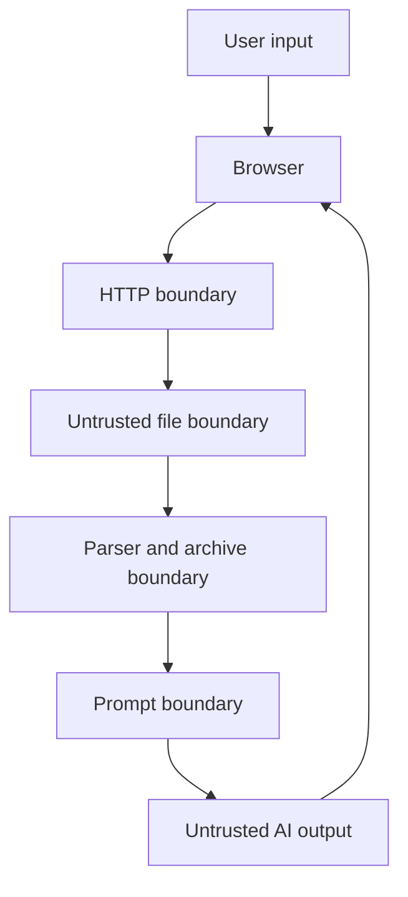

# Security and privacy baseline

Nook Forge handles user files and model input, so local-only does not mean risk-free. These rules apply before a file reaches an AI task.

## Trust boundaries

Every boundary validates and limits its input.

## Upload and archive threats

The implementation must defend against path traversal, ZIP Slip, archive bombs, too many entries, oversized files, unsafe links, encrypted archives, parser crashes, dangerous file names, and stale temporary data. See [file and archive workspaces](file-workspaces.md).

## Uploaded code

Uploaded source code is text data. Nook Forge does not compile, import, execute, install, run tests from, or start an uploaded project.

Macros, scripts, executables, JARs, native libraries, and nested archives are not executed or unpacked.

## Prompt injection

A document may contain text such as “ignore all rules.” The AI adapter must delimit source text and state that source content is data, not an instruction. Task prompts cannot grant tools or change provider configuration.

Results that rely on source content keep source references and unknowns. The model must not claim it inspected omitted files.

## AI output

AI output is untrusted. The API validates its schema and length. The Angular app sanitizes Markdown and does not enable raw HTML, scripts, unsafe links, or embedded remote media by default.

## Local network exposure

Compose ports bind to loopback by default. The app has no authentication through Release 0.5, so exposing it to a LAN or public interface requires an explicit user choice and is not a supported secure multi-user setup.

## Secrets

- `.env` is ignored and never committed.
- Keys are read only through validated configuration.
- Secrets are not placed in URLs, logs, task records, trace data, screenshots, or exports.
- The current Ollama-only stack needs no cloud model key.
- Langfuse credentials are local runtime secrets when Release 0.5 is implemented.
- Penpot MCP keys and token-bearing server URLs stay outside the repository and visual evidence.

## Observability privacy

Logs record safe IDs, state, timing, counts, and bounded error codes. They do not record raw document text, prompts, responses, original local paths, or secrets.

Langfuse content tracing is disabled by default. Enabling it requires an explicit setting and a clear warning that prompt, response, or document content may be stored by the configured local trace service.

A failed Langfuse, Prometheus, or Grafana service must not fail or change a user task.

## Screenshot privacy

Product screenshots use invented fixtures and deterministic states. They must not contain real uploads, prompts, credentials, machine names, private trace content, or local paths.

Nook Forge does not run an uploaded project to create screenshots for generated documentation. It may reuse a verified source screenshot or report that the visual evidence is missing.

## Source-file integrity

Original uploads are immutable to task workflows. Generated files use separate paths and checksums. An augmented archive is always a new artifact.

## Dependency and image rules

Dependencies and container images are pinned by lock files or immutable release tags during implementation. Dynamic `latest` tags are not allowed in verified release configuration.

## Reporting

Security-related communication must use the maintainer contact information on [kereszteszsolt.hu](https://kereszteszsolt.hu/). Sensitive security details must not be published through public repository channels.
