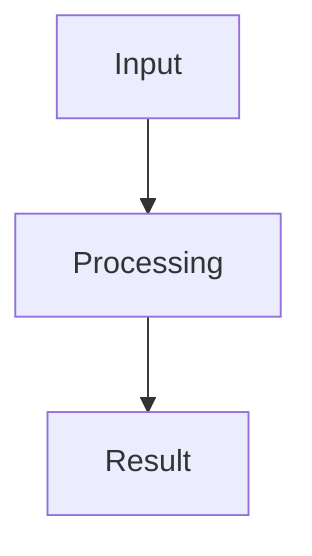

# Visual documentation

## Purpose

Visual evidence should explain real, implemented behavior. It must not turn planned screens into current product claims or expose private data.

## Documents that need visual support

| Document | Visual expectation after implementation |
| --- | --- |
| Root `README.md` | one current product screenshot and one high-level vertical architecture diagram |
| `docs/user-guide.md` | step screenshots for the main user paths and important failure states |
| `docs/architecture.md` | focused Mermaid diagrams with top-to-bottom flow |
| `docs/configuration.md` | a small startup or deployment-flow diagram when it improves clarity |
| Release `verification.md` | screenshots and diagram links that prove the released behavior |
| ADRs | visuals only when they clarify a decision that prose cannot explain well |

A document does not need an image merely to satisfy a count. Add a screenshot or diagram only when it helps the reader understand a verified state, path, or boundary.

## Screenshot capture

Use deterministic Playwright automation for product screenshots. The owning story may use a repository capture script, a Playwright test, or Playwright MCP when that is the best available route.

The documentation must not require a specific IDE, host environment, or operating system. Release evidence records the actual method, command, route, viewport, fixture, and story used for each capture.

Every checked screenshot must:

- use invented fixture data;
- avoid personal files, real prompts, local paths, machine names, credentials, and tokens;
- use a stable viewport and deterministic application state;
- be inspected before commit;
- have a clear file name, Markdown alt text, and related story;
- be replaced when the shown behavior or interface is no longer current.

## Product and uploaded-project boundary

Codex may start the implemented Nook Forge AI application to capture its own interface.

Nook Forge AI must not build, start, execute, or test an uploaded project only to create screenshots for generated documentation. A documentation task may reuse a verified screenshot asset already present in the uploaded source, or it may mark the missing visual as an unresolved documentation item.

## Evidence layout

Store browser captures under release folders:

```text
docs/screenshots/
├── release-0.1/
├── release-0.2/
├── release-0.3/
├── release-0.4/
└── release-0.5/
```

Each release folder keeps a short index with this metadata:

| Image | Story | Route | Viewport | Fixture | Capture method | Reviewed |
| --- | --- | --- | --- | --- | --- | --- |
| `example.png` | `NFA-000` | `/example` | `1440x900` | `synthetic-example` | Playwright | Pending |

Penpot exports remain under `docs/design`. Browser screenshots remain under `docs/screenshots`.

## Mermaid direction

Use vertical diagrams by default:



Rules:

- use `flowchart TB` for architecture, deployment, configuration, and data-flow diagrams;
- split a wide system into smaller diagrams instead of forcing many nodes into one row;
- keep subgraphs and their main dependency direction top-to-bottom;
- use a sequence diagram only when time order is the main point;
- add `direction TB` to a class diagram when the renderer and layout need it;
- verify Mermaid syntax and GitHub rendering before release evidence is accepted;
- generated documentation follows the same vertical-first rule.

## Review chain

For a UI story with a supplied Penpot link, visual review compares:

```text
Penpot source
      ↓
repository design tokens
      ↓
Angular implementation
      ↓
Playwright screenshots
      ↓
release evidence
```

A missing Penpot connection, missing browser proof, or unreviewed image stays visible as a gap. Codex must not fabricate a design ID, screenshot, or verification result.
